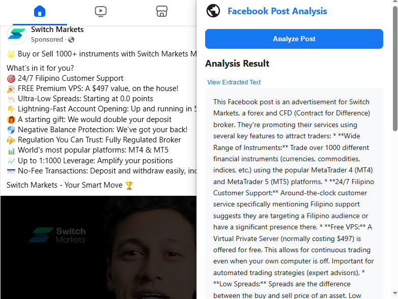

# Facebook Post Analyzer

This project is a Chrome Extension that helps analyze Facebook posts for insights and patterns.



## Creator
This project was created by John Carlos Sebuco.

## Setup Instructions

### 1. Clone the Repository
```bash
git clone https://github.com/JohnCarlosSebuco/facebook-analyzer-ext-ui.git
cd facebook-post-analyzer
```

### 2. Install Dependencies (if applicable)
If your project requires dependencies, install them using:
```bash
npm install
```

### 3. Load the Extension in Chrome
1. Open Chrome and navigate to `chrome://extensions/`.
2. Enable **Developer mode** (toggle in the top-right corner).
3. Click on **Load unpacked**.
4. Select the folder where you cloned the repository.

### 4. Start Using the Extension
- Once loaded, the extension icon will appear in the Chrome toolbar.
- Click the icon to start analyzing Facebook posts.

## Contributing
Feel free to submit issues or pull requests to improve the project.
